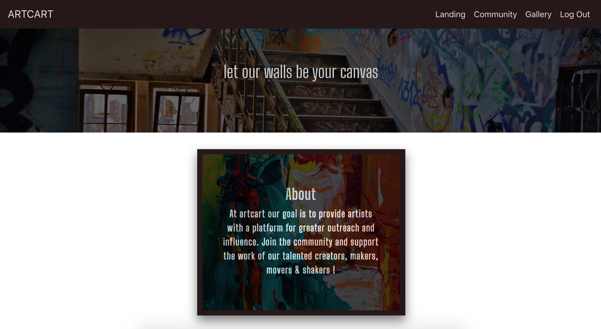
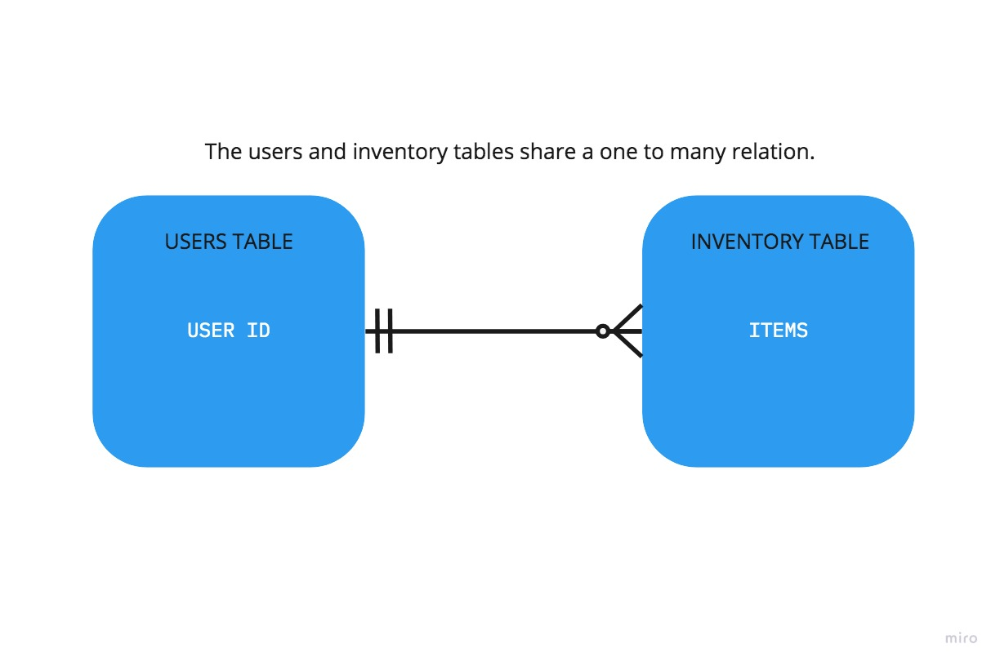

## ARTCART

## Capstone Project for the American Express Developer Academy
ArtCart: a web-based art community meant to encourage, enfranchise and empower artists by providing a platform to display their work, convey their message and expand their influence. 

## Designed by:  
Rosendo Pili (<a href="https://github.com/rosendopili">@rosendopili</a>) 

## TECHNOLOGIES USED
* React.JS 
* JAVA 
* Docker
* Zuul & Eureka
* PostgreSQL

## FUNCTIONALITY

The back-end of this project is comprised of a microservice API with User and Inventory tables.  

The ArtCart API is a dockerized spring-boot application with a eureka server and zuul gateway. 

The front-end of this project was constructed using React.JS. 

The API endpoints enable user signup, login, delete user, create items, delete items, list all items, list items by user, list users and retrieve a single user by username.  

The front-end application currently enables users to signup, log in, create items, list all items and list all users. 

Due to time constraints, I was unable to utilize all of the API functionality but as it stands, the ArtCart web application still holds value as a means for users to interact with other members of the ArtCart community while displaying works of art or photography. 

**PLANNING DOCUMENTATION**

ERD for back-end to front-end workflow. 

	
DataTable relations between User and Inventory. 

## HURDLES, SETBACKS & SUCCESSES 

I originally set forth to create a web-based arcade application.  My monolith API was designed to manage player accounts and statistics, however, the setbacks I encountered (namely with refactoring my Javascript code to React specifications) gave me pause enough to pivot.  

I quickly re-worked my existing API to include a user profile model, in addition to the existing user model, and added a datatable to handle user inventory.  

With my monolith API complete and endpoint efficacy cconfirmed through postman testing, I Dockerized my project along with a Zuul API-gateway and Eureka server functionality.  I was under the gun here, with the weekend behind me and a partial front-end design left over from my original arcade idea, I was lucky enough to have spent only a day to get my microservice up and running.  

Using cloudinary's image-hosting service, I was able to create an upload form for user photos that in turn, provided me with a URL that could be saved to my database.  Unfortunately I was unable to implement this in my final project and decided to let users upload existing URLs as a temporary work-around. 

Additionally, I began refactoring my API to expand the user data table and remove the userprofile table all together.  My new UI allowed existing users to log in while new users are routed to a signup page that collects their profile information.  This allowed me to bypass some complexity with my front-end rendering as the user profile functionalities would have all required token authorization.  

With login and signup functionality for onboarding new and existing users, once I resolved the issue of user authentication and successfully posting new gallery-items while logged in, I had a minimal viable product.  Albeit, one that required a lot more work.  

## USER STORIES

**USER**
* As a user, I want a platform to host my art and connect with other members of the art community. 

**INTERNAL STAKEHOLDER**
* As an internal stakeholder and funder, I want to see the online art community grow through the use of ArtCart and eventually monetize the terms of membership. 

**ADMIN**
* As an admin, I can access the database to remove any explicit content and delete any users that violate ArtCart's terms and conditions. 

## Related Links

Pictures of my postman tests can be viewed in the [here](https://github.com/rosendopili/CapStoneProject/tree/master/CapStoneProject/POSTMAN_TESTING).
